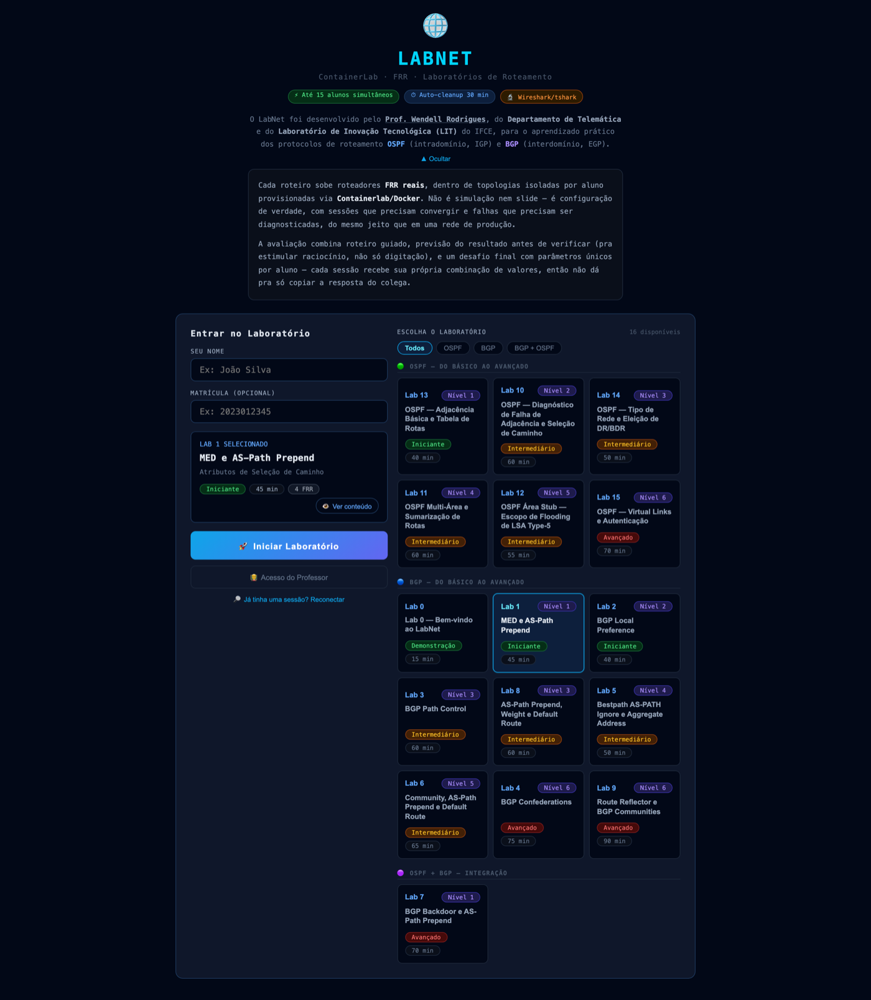
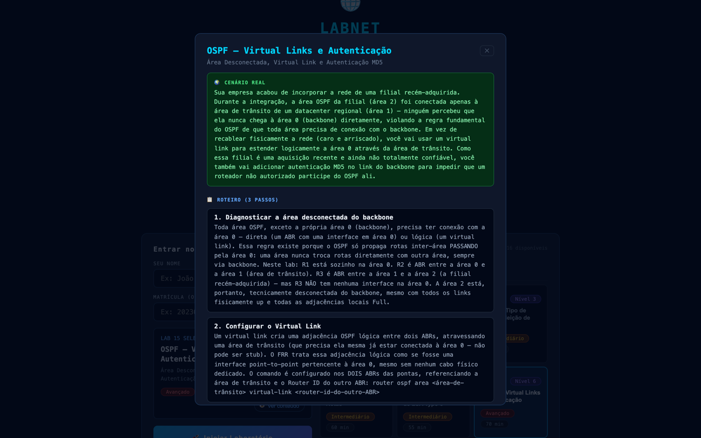
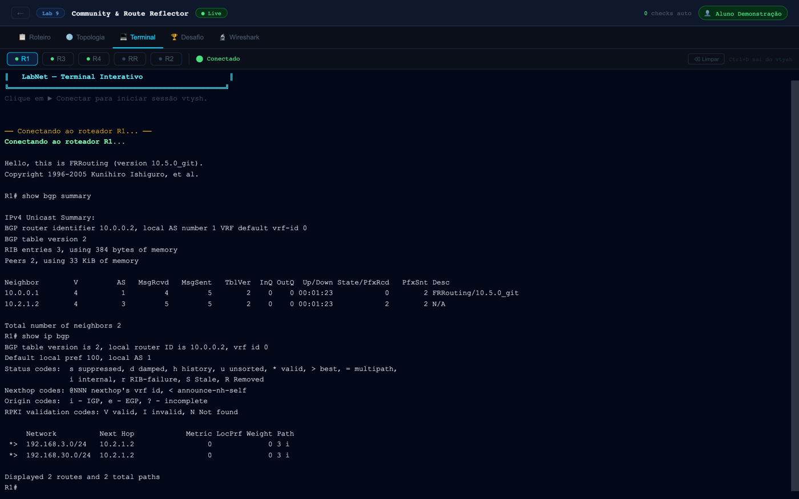
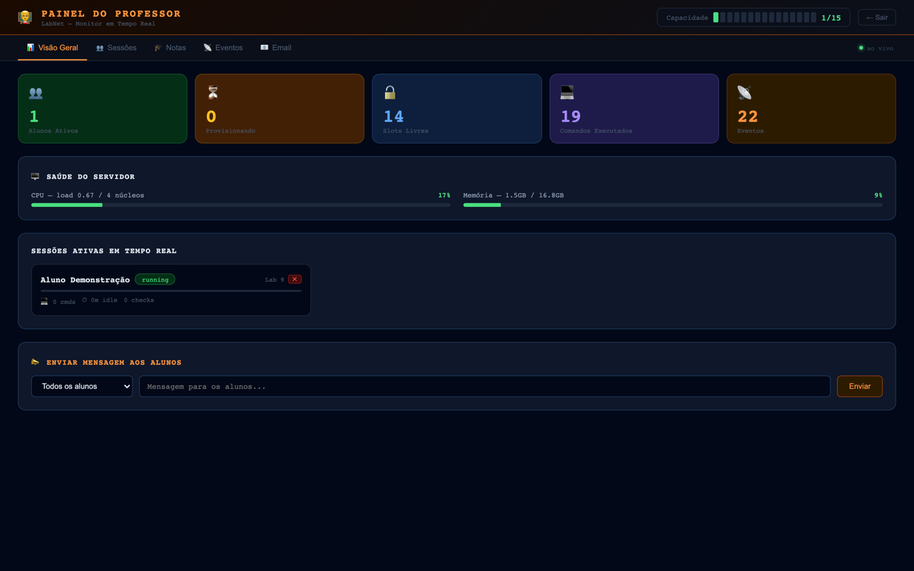
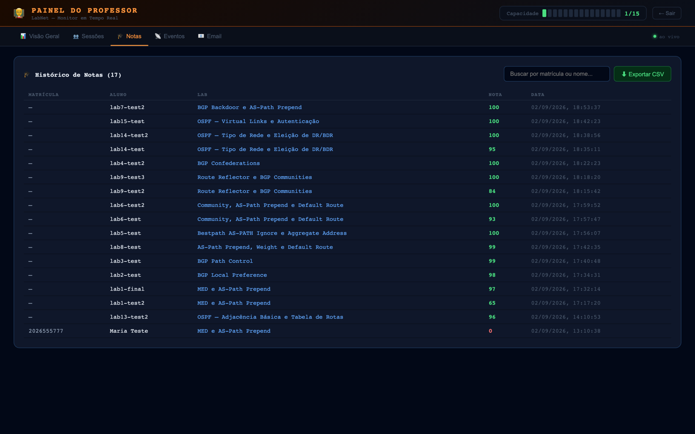

# LabNet - Plataforma de Laboratórios de Roteamento

Plataforma web para laboratorios praticos de BGP, OSPF e OSPF+BGP com FRR,
Containerlab e Docker. O sistema provisiona automaticamente uma topologia
isolada por aluno e suporta ate 15 alunos simultaneos, respeitando os
recursos do servidor.

Produção: [labnet.ioda.com.br](https://labnet.ioda.com.br)

O currículo segue uma **escala evolutiva** deliberada: cada protocolo tem
sua própria trilha (OSPF, BGP, OSPF+BGP), organizada em níveis de 1
(fundamentos) a 6 (avançado) — o aluno nunca encontra um conceito antes de
ter o alicerce pedagógico pra ele. Veja a tabela completa em
[Labs Disponíveis](#labs-disponiveis).

## Capturas de Tela

| | |
|---|---|
|  Catálogo — trilhas OSPF/BGP/OSPF+BGP, níveis 1-6 |  Prévia do roteiro antes de provisionar |
|  Terminal `vtysh` ao vivo, roteador FRR real |  Painel do professor — sessões e saúde do servidor em tempo real |

<details>
<summary>Histórico de notas do professor</summary>



</details>

## Estado Atual

- Frontend React/Vite servido por Nginx em container Docker.
- Backend Node.js/Express rodando diretamente no host Linux via systemd.
- Containerlab tambem roda no host Linux, nao dentro de container.
- Roteadores dos labs usam `quay.io/frrouting/frr:10.5.0`.
- Cada aluno recebe containers FRR proprios, com nomes `clab-<session>-<router>`.
- Autenticação real de professor: `POST /api/auth/teacher` retorna um bearer
  token (`crypto.randomBytes`), exigido em todo `/api/admin/*` — o token vive
  em memória e não sobrevive a um restart do backend (professor loga de novo).
- Histórico de notas persistente por matrícula, em `grades.jsonl` fora do
  repositório (sobrevive a `git pull`/restart), consultável em
  `GET /api/admin/grades` e na aba "🎓 Notas" do painel.
- Recuperação de sessão: se o aluno voltar à tela inicial no meio de um lab,
  o LabNet oferece reconectar à sessão em andamento em vez de perdê-la.
- Professor acompanha sessoes, comandos, progresso, notas e saúde do
  servidor (CPU/memória) em tempo real.
- Ao enviar respostas, o backend corrige, calcula a nota e envia relatorio por e-mail via Resend.

## Por Que O Backend Roda No Host

Em producao, o Containerlab precisa manipular diretamente namespaces, bridges e
veths do Docker host. Rodar o provisionador dentro de outro container causou erros
de namespace e criacao de links. Por isso, o desenho suportado em VPS Linux e:

- Portainer/Docker Compose: apenas frontend estatico.
- Host Linux/systemd: backend/provisioner + Containerlab.
- Host Nginx: TLS e proxy reverso.

## Labs Disponiveis

16 labs no total, cada um com falha proposital ou desafio de diagnóstico
para investigar (não um tutorial de copiar-e-colar), `variables` que
randomizam parâmetros por sessão, e `predict` — previsão do resultado antes
de verificar.

### Trilha OSPF (fundamentos → avançado)

| Lab | Nível | Título | Perfil |
|---|---|---|---|
| 13 | 1 | OSPF — Adjacência Básica e Tabela de Rotas | leve |
| 10 | 2 | OSPF — Diagnóstico de Falha de Adjacência e Seleção de Caminho | leve |
| 14 | 3 | OSPF — Tipo de Rede e Eleição de DR/BDR | leve |
| 11 | 4 | OSPF Multi-Área e Sumarização de Rotas | leve |
| 12 | 5 | OSPF Área Stub — Escopo de Flooding de LSA Type-5 | leve |
| 15 | 6 | OSPF — Virtual Links e Autenticação | leve |

### Trilha BGP (fundamentos → avançado)

| Lab | Nível | Título | Perfil |
|---|---|---|---|
| 0 | — | Lab 0 — Bem-vindo ao LabNet (demonstração guiada pelo professor) | leve |
| 1 | 1 | MED e AS-Path Prepend | leve |
| 2 | 2 | BGP Local Preference | leve |
| 3 | 3 | BGP Path Control | leve |
| 8 | 3 | AS-Path Prepend, Weight e Default Route | leve |
| 5 | 4 | Bestpath AS-PATH Ignore e Aggregate Address | leve |
| 6 | 5 | Community, AS-Path Prepend e Default Route | leve |
| 4 | 6 | BGP Confederations | moderado |
| 9 | 6 | Route Reflector e BGP Communities | moderado |

### Trilha OSPF+BGP (integração — capstone)

| Lab | Nível | Título | Perfil |
|---|---|---|---|
| 7 | 1 | BGP Backdoor e AS-Path Prepend | leve |

Os labs ficam em `backend/labs/lab-XX.js` e sao carregados automaticamente. Para
ocultar um lab sem apagar o arquivo, use `enabled: false`. Veja
`backend/labs/README.md` para o schema completo, incluindo os campos
`protocol`, `level`, `variables` (aleatorização por sessão) e `predict`
(previsão antes de verificar).

## Arquitetura De Producao

```text
Internet
  |
Host Nginx :80/:443
  |-- /api, /ws, /graph -> http://127.0.0.1:3000  (backend systemd)
  |-- /                 -> http://127.0.0.1:8088  (frontend Portainer)

Backend host:
  - Node.js/Express
  - WebSocket
  - Containerlab
  - Docker CLI
  - systemd service: labnet-backend

Docker:
  - bgplab-nginx: frontend estatico
  - clab-<session>-R1/R2/...: roteadores FRR por aluno
```

## Requisitos Do Servidor

- Linux VPS com Docker funcionando.
- Node.js 20+.
- Containerlab.
- Nginx no host para TLS/proxy.
- 4 vCPU e 8 GB RAM para ate cerca de 15 alunos em labs leves.
- Mais RAM/CPU se muitos alunos usarem labs com 5+ roteadores simultaneamente.

## Deploy Do Backend No Host

No VPS:

```bash
sudo mkdir -p /opt/bgp-labs
git clone https://github.com/wendellr/LabNet.git /opt/labnet
cd /opt/labnet

sudo HOST=127.0.0.1 \
  PORT=3000 \
  MAX_STUDENTS=15 \
  MGMT_SUBNET_START=200 \
  MGMT_SUBNET_POOL_SIZE=50 \
  LAB_HOST_BASE_DIR=/opt/bgp-labs \
  FRR_IMAGE=quay.io/frrouting/frr:10.5.0 \
  TEACHER_PASSWORD='sua-senha-forte' \
  TEACHER_EMAIL='professor@dominio.com' \
  RESEND_API_KEY='re_xxx' \
  RESEND_FROM='onboarding@resend.dev' \
  bash scripts/install-host-backend.sh
```

O script:

- copia o projeto para `/opt/labnet`;
- instala dependencias do backend com `npm ci --omit=dev`;
- cria `/opt/labnet/backend/.env`;
- cria e inicia o servico `labnet-backend`.

Comandos uteis:

```bash
sudo systemctl status labnet-backend --no-pager
sudo journalctl -u labnet-backend -f
curl -i http://127.0.0.1:3000/api/health
curl -s http://127.0.0.1:3000/api/labs
```

Para atualizar o backend depois de novos commits:

```bash
cd /opt/labnet
sudo git pull
sudo systemctl restart labnet-backend
```

## Deploy Do Frontend Pelo Portainer

No Portainer:

1. `Stacks` -> `Add stack`.
2. Escolha `Repository`.
3. Repository URL: `https://github.com/wendellr/LabNet.git`.
4. Branch: `main`.
5. Compose path: `docker-compose.yml`.
6. Configure as variaveis:

```env
HTTP_BIND=127.0.0.1
HTTP_PORT=8088
```

O `docker-compose.yml` padrao sobe apenas o frontend (`bgplab-nginx`) em
`127.0.0.1:8088`.

O servico `backend` existe no compose somente para testes e fica atras do profile
`containerized-backend`. Em VPS/producao, nao use esse backend containerizado.

Depois de commits que mudem o frontend, faca redeploy da stack no Portainer.

## Nginx Do Host

Exemplo para `labnet.ioda.com.br` com certificados LetsEncrypt ja existentes:

```nginx
server {
    listen 80;
    server_name labnet.ioda.com.br;
    return 301 https://$host$request_uri;
}

server {
    listen 443 ssl;
    http2 on;
    server_name labnet.ioda.com.br;

    ssl_certificate /etc/letsencrypt/live/labnet.ioda.com.br/fullchain.pem;
    ssl_certificate_key /etc/letsencrypt/live/labnet.ioda.com.br/privkey.pem;
    ssl_protocols TLSv1.2 TLSv1.3;
    ssl_session_timeout 1d;
    ssl_session_cache shared:SSL:10m;
    ssl_session_tickets off;

    location /ws {
        proxy_pass http://127.0.0.1:3000;
        proxy_http_version 1.1;
        proxy_set_header Upgrade $http_upgrade;
        proxy_set_header Connection "upgrade";
        proxy_set_header Host $host;
        proxy_set_header X-Real-IP $remote_addr;
        proxy_read_timeout 86400s;
        proxy_send_timeout 86400s;
        proxy_buffering off;
    }

    location /graph/ {
        proxy_pass http://127.0.0.1:3000;
        proxy_http_version 1.1;
        proxy_set_header Host $host;
        proxy_read_timeout 60s;
    }

    location /api/ {
        proxy_pass http://127.0.0.1:3000;
        proxy_http_version 1.1;
        proxy_set_header Host $host;
        proxy_set_header X-Real-IP $remote_addr;
        proxy_set_header X-Forwarded-For $proxy_add_x_forwarded_for;
        proxy_set_header X-Forwarded-Proto https;
        proxy_read_timeout 120s;
    }

    location / {
        proxy_pass http://127.0.0.1:8088;
        proxy_http_version 1.1;
        proxy_set_header Host $host;
        proxy_set_header X-Real-IP $remote_addr;
        proxy_set_header X-Forwarded-For $proxy_add_x_forwarded_for;
        proxy_set_header X-Forwarded-Proto https;
    }
}
```

Depois:

```bash
sudo nginx -t
sudo systemctl reload nginx
```

## Variaveis Do Backend

Arquivo real no VPS:

```text
/opt/labnet/backend/.env
```

Exemplo:

```env
HOST=127.0.0.1
PORT=3000
MAX_STUDENTS=15
MGMT_SUBNET_START=200
MGMT_SUBNET_POOL_SIZE=50
LAB_BASE_DIR=/opt/bgp-labs
LAB_HOST_BASE_DIR=/opt/bgp-labs
FRR_IMAGE=quay.io/frrouting/frr:10.5.0
TEACHER_PASSWORD=sua-senha-forte
TEACHER_EMAIL=professor@dominio.com
RESEND_API_KEY=re_xxx
RESEND_FROM=onboarding@resend.dev
NODE_ENV=production
```

## Email Com Resend

O envio de e-mail ocorre quando o aluno envia as respostas do desafio.

Importante sobre a Resend:

- Em modo teste, a Resend so permite enviar para o e-mail dono da conta.
- Para enviar para outros destinatarios, verifique um dominio em `resend.com/domains`.
- Depois de verificar o dominio, use um remetente desse dominio em `RESEND_FROM`.

Exemplo para teste:

```env
TEACHER_EMAIL=seu-email-da-conta-resend@gmail.com
RESEND_FROM=onboarding@resend.dev
```

Exemplo para producao com dominio verificado:

```env
TEACHER_EMAIL=professor@dominio.com
RESEND_FROM=no-reply@seudominioverificado.com.br
```

Evite colocar nome com espacos no `RESEND_FROM` dentro do `EnvironmentFile` do
systemd. Prefira o e-mail puro.

Teste de envio direto no VPS:

```bash
cd /opt/labnet/backend
sudo node -e "
require('dotenv').config({ path: './.env' });
const { Resend } = require('resend');
const resend = new Resend(process.env.RESEND_API_KEY);
resend.emails.send({
  from: process.env.RESEND_FROM || 'onboarding@resend.dev',
  to: [process.env.TEACHER_EMAIL],
  subject: 'Teste LabNet Resend',
  html: '<p>Teste de envio do LabNet.</p>'
}).then(r => console.log(JSON.stringify(r, null, 2)))
  .catch(e => { console.error(e); process.exit(1); });
"
```

Logs de e-mail:

```bash
sudo journalctl -u labnet-backend -n 200 --no-pager | grep -i email
```

## Fluxo Do Aluno

1. Acessa o dominio do LabNet.
2. Digita nome (e matrícula, opcional) e escolhe o lab — pode espiar o roteiro na prévia antes de provisionar.
3. Backend provisiona a topologia Containerlab da sessao, com valores aleatorizados por sessão (`variables`).
4. Aluno usa o terminal `vtysh` dos roteadores FRR.
5. Aluno segue roteiro, prevê o resultado antes de verificar (`predict`), executa verificacoes e responde ao desafio.
6. Se voltar à tela inicial no meio do lab, o LabNet oferece reconectar à sessão em andamento.
7. Ao enviar respostas, recebe nota e feedback; a nota fica registrada no histórico do professor por matrícula.
8. Professor recebe relatorio por e-mail se Resend estiver configurado.

## Painel Do Professor

O professor acessa pela tela inicial usando `TEACHER_PASSWORD`. O login
(`POST /api/auth/teacher`) retorna um bearer token exigido por todo
`/api/admin/*` e pela autenticação do WebSocket como `role: teacher` — sem
token válido, os endpoints administrativos retornam 401. O token vive em
memória do processo, então um restart do backend exige novo login.

Abas do painel:

- **Visão Geral**: sessões ativas, saúde do servidor (CPU/memória), envio de mensagens aos alunos;
- **Sessões**: progresso, histórico de comandos, encerramento manual de sessão;
- **Notas**: histórico de notas persistente por matrícula (`grades.jsonl`), busca e exportação CSV;
- **Eventos**: linha do tempo em tempo real (provisionamento, comandos, submissões, auto-cleanup);
- **Email**: configuração de envio de relatório por Resend.

Quando o professor encerra uma sessao, a tela do aluno volta automaticamente para o menu.

## Auto-Cleanup

O backend remove sessoes inativas:

- aviso apos cerca de 20 minutos;
- cleanup apos cerca de 30 minutos;
- `containerlab destroy --cleanup`;
- parada do graph server da sessao;
- limpeza dos terminais PTY.

## Avaliacao

Cada lab pode ter:

- `autoGrade`: checkpoints de progresso enquanto o aluno executa comandos;
- `verifications`: criterios tecnicos usados na nota final (70% da nota);
- `challenge.questions`: questoes objetivas;
- `answerKey`: gabarito e pontuacao (30% da nota) — inclui também as
  respostas de `predict` (previsão antes de verificar), avaliadas por
  palavra-chave;
- `variables`: pools de valores resolvidos de forma determinística por
  sessão (mesmo aluno sempre vê os mesmos valores).

Notas ficam registradas em `grades.jsonl` (fora do repositório, dentro de
`LAB_BASE_DIR`) por matrícula, consultáveis pelo professor a qualquer
momento, mesmo depois de a sessão em memória ter sido limpa.

O relatorio por e-mail inclui:

- aluno;
- lab;
- score;
- verificacoes tecnicas;
- respostas;
- historico recente de comandos.

## Estrutura Do Projeto

```text
.
├── backend/
│   ├── server.js
│   ├── labs-data.js
│   ├── labs/
│   │   ├── index.js
│   │   ├── lab-01.js
│   │   └── ...
│   └── .env.example
├── frontend/
│   ├── src/
│   ├── Dockerfile
│   └── nginx.conf
├── scripts/
│   └── install-host-backend.sh
├── docs/
│   └── screenshots/
├── docker-compose.yml
├── stack.env.example
└── README.md
```

Para criar, editar ou ocultar labs, veja `backend/labs/README.md`.

## Troubleshooting

Ver backend:

```bash
sudo systemctl status labnet-backend --no-pager
sudo journalctl -u labnet-backend -f
```

Ver API:

```bash
curl -i http://127.0.0.1:3000/api/health
curl -s http://127.0.0.1:3000/api/labs
```

Ver frontend:

```bash
docker ps | grep bgplab-nginx
curl -i http://127.0.0.1:8088
```

Listar containers de labs:

```bash
sudo docker ps --filter "name=clab-"
```

Limpar labs orfaos com cuidado:

```bash
sudo containerlab destroy -t /opt/bgp-labs/session-<id>/topology.yml --cleanup
```

Se novos labs nao aparecem no frontend:

1. Confira se o backend host foi atualizado:

```bash
cd /opt/labnet
sudo git pull
sudo systemctl restart labnet-backend
curl -s http://127.0.0.1:3000/api/labs
```

2. Se a API ja mostra os labs novos, faca redeploy da stack no Portainer.
3. Limpe cache do navegador ou teste em janela anonima.

## Desenvolvimento Local

Frontend:

```bash
cd frontend
npm install
npm run dev
```

Backend:

```bash
cd backend
npm install
HOST=127.0.0.1 PORT=3000 LAB_BASE_DIR=/tmp/bgp-labs node server.js
```

Em macOS/Windows, a UI e API podem rodar localmente, mas o provisionamento completo
com Containerlab deve ser testado em Linux com Docker/Containerlab no host.

Build do frontend como no deploy:

```bash
docker compose build nginx
```
